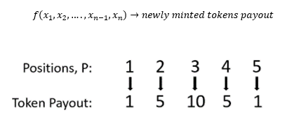

<p align="center">
  <a href='https://www.tellor.io/'>
    
  </a>
</p>

<p align="center">
  <a href='https://deriveth.slack.com/'>
    
  </a>
  <a href='https://t.me/tellor'>
    
  </a>
  <a href='https://twitter.com/WeAreTellor'>
    
  </a> 
</p>
    
## Table of Contents
   * [Overview](#overview)
   * [Implementation](#implementation)
     * [Incentives](#incentives)
     * [Mining](#mining)
     * [Security](#security)
   * [Potential Applications](#potential-applications)
   * [Conclusion](#Conclusion)
   * [Updates](#Updates)

<details><summary>Contributing information</summary>

   * [Maintainers](#Maintainers)
   * [How to Contribute](#how2contribute)
   * [Copyright](#copyright)
 </details>

## Overview <a name="overview"> </a>
Ethereum smart contracts cannot access off-chain data. If your smart contract relies on off-chain (e.g. internet) data to evaluate or execute a function, you either have to manually feed the data to your contract, incentivize users to do it, or rely on a centralized party to provide the data (Oraclize.it is generally the standard).

The tellor oracle is a decentralized oracle. It provides a decentralized alternative for contracts to interact with and obtain data from off-chain (aka API data). 

Tellor implements a hybrid Proof-of-work (PoW)/Proof-of-Stake (PoS) model where miners have to stake tellor tributes (tellor's native token) to be able to mine and along with the PoW solution they also provide an off-chain data point. The first five miners to provide the PoW and off-chain data point are rewarded: the miner with the median value is given the highest reward since that is what is used as the 'official' value and the four miners get a lower reward that decreases the further they are from the median. Once validated and processed the value is available for on-chain contracts to use. The value can be disputed by anyone holding tellor tributes within 10 blocks after being mined for a fee. After the value goes to dispute, anyone holding tributes can vote on it's validity. If the vote determines the value was invalid the reporting party gets awarded the miner's stake, otherwise the wrongly accused miner gets the reporting fee.

<p align="center">

</p>

## Implementation <a name="Implementation"> </a>

The Tellor Oracle deploys two contracts. TellorMaster is the storage contract and allows for delegate calls from Tellor.sol. The Tellor oracle holds and distributes the token supply, informs miners which values to submit, has a built-in proof-of-stake methodology for challenges, and holds the historically mined values that contracts can read from. 

Tellor provides the miners and users the API or data description, along with necessary fields for the data it is collecting and allows miners to submit the proof of work and off-chain data, sorts the values, allows the users to retrieve the values and to bid on which data series is mined next.  Tellor allows for new values to be mined every 10 minutes and which data series is mined is determined by which series has the greatest tip going to the miners.  

Miners are required to stake tributes before they are allowed to mine. The <b>submitMiningSolution</b> function contains a require statement that ensures this. Once the miner is staked, the stake gets locked for the minimum stake period (one month) and if any dispute is raised against them during that period the stake gets locked until the dispute vote time period expires. 

The basic flow for adding and retrieving data goes like this: 

1. The user submits a request via the <b>requestData</b> function using Tributes to incentivize miners to choose a query over other submissions. The user needs to specify the API, timestamp and tip. Once a user submits a query the API will get an unique ID assigned to it and if the tip submitted for the request is larger than that of the current query on queue the current request will replace it via the <b>updateAPIonQ</b> function. 

These are the requestData and updateAPIonQ functions:
```solidity
    /**
    * @dev Request to retreive value from oracle based on timestamp. The tip is not required to be 
    * greater than 0 because there are no tokens in circulation for the initial(genesis) request 
    * @param _c_sapi string API being requested be mined
    * @param _c_symbol is the short string symbol for the api request
    * @param _granularity is the number of decimals miners should include on the submitted value
    * @param _tip amount the requester is willing to pay to be get on queue. Miners
    * mine the onDeckQueryHash, or the api with the highest payout pool
    */
    function requestData(TellorStorage.TellorStorageStruct storage self,string memory _c_sapi,string memory _c_symbol,uint _granularity, uint _tip) public {
        //Require at least one decimal place
        require(_granularity > 0);
        
        //But no more than 18 decimal places
        require(_granularity <= 1e18);
        
        //If it has been requested before then add the tip to it otherwise create the queryHash for it
        string memory _sapi = _c_sapi;
        string memory _symbol = _c_symbol;
        require(bytes(_sapi).length > 0);
        require(bytes(_symbol).length < 64);
        bytes32 _queryHash = keccak256(abi.encodePacked(_sapi,_granularity));
        
        //If this is the first time the API and granularity combination has been requested then create the API and granularity hash 
        //otherwise the tip will be added to the requestId submitted
        if(self.requestIdByQueryHash[_queryHash] == 0){
            self.uintVars[keccak256("requestCount")]++;
            uint _requestId=self.uintVars[keccak256("requestCount")];
            self.requestDetails[_requestId] = TellorStorage.Request({
                queryString : _sapi, 
                dataSymbol: _symbol,
                queryHash: _queryHash,
                requestTimestamps: new uint[](0)
                });
            self.requestDetails[_requestId].apiUintVars[keccak256("granularity")] = _granularity;
            self.requestDetails[_requestId].apiUintVars[keccak256("requestQPosition")] = 0;
            self.requestDetails[_requestId].apiUintVars[keccak256("totalTip")] = 0;
            self.requestIdByQueryHash[_queryHash] = _requestId;
            
            //If the tip > 0 it tranfers the tip to this contract
            if(_tip > 0){
                TellorTransfer.doTransfer(self, msg.sender,address(this),_tip);
            }
            updateOnDeck(self,_requestId,_tip);
            emit DataRequested(msg.sender,self.requestDetails[_requestId].queryString,self.requestDetails[_requestId].dataSymbol,_granularity,_requestId,_tip);
        }
        //Add tip to existing request id since this is not the first time the api and granularity have been requested 
        else{
            addTip(self,self.requestIdByQueryHash[_queryHash],_tip);
        }
    }


    /**
    * @dev Add tip to Request value from oracle
    * @param _requestId being requested to be mined
    * @param _tip amount the requester is willing to pay to be get on queue. Miners
    * mine the onDeckQueryHash, or the api with the highest payout pool
    */
    function addTip(TellorStorage.TellorStorageStruct storage self,uint _requestId, uint _tip) public {
        require(_requestId > 0);

        //If the tip > 0 transfer the tip to this contract
        if(_tip > 0){
            TellorTransfer.doTransfer(self, msg.sender,address(this),_tip);
        }

        //Update the information for the request that should be mined next based on the tip submitted
        updateOnDeck(self,_requestId,_tip);
        emit TipAdded(msg.sender,_requestId,_tip,self.requestDetails[_requestId].apiUintVars[keccak256("totalTip")]);
    }
```
2. Other users who want the same API data, they pay or ‘Addtip’ this data series so miners are further incentivized to mine it. If the API has already been requested, the <b>requestData</b> function will automatically add to the previously submitted query to create a pool and help push the query up the queue.

3. Every 10 minutes, the Oracle provides a new challenge along with the data series for miners to mine. 

4. Miners can stake using the <b>depositStake</b> function and the stake will be locked for a minimum time period. Also, if a dispute against a miner is raised, the stake is locked through the dispute process. The stake is locked in the doTranfer and approve functions via the allowedToTrade function (which checks the balance avaiable for transfer or approval and excludes any stake amount).

```solidity
    /**
    * @dev This function approves a _spender an _amount of tokens to use
    * @param _spender address
    * @param _amount amount the spender is being approved for
    * @return true if spender appproved successfully
    */
    function approve(TellorStorageStruct storage self, address _spender, uint _amount) public returns (bool) {
        require(allowedToTrade(self,msg.sender,_amount));
        self.allowed[msg.sender][_spender] = _amount;
        emit Approval(msg.sender, _spender, _amount);
        return true;
    }

    /**
    * @dev This function returns whether or not a given user is allowed to trade a given amount 
    * and removing the staked amount from their balance if they are staked
    * @param _user address of user
    * @param _amount to check if the user can spend
    * @return true if they are allowed to spend the amount being checked
    */
    function allowedToTrade(TellorStorageStruct storage self,address _user,uint _amount) public view returns(bool){
        if(self.stakerDetails[_user].currentStatus >0){
            //Removes the stakeAmount from balance if the _user is staked
            if(balanceOf(self,_user).sub(self.uintVars[keccak256("stakeAmount")]).sub(_amount) >= 0){
                return true;
            }
        }
        else if(balanceOf(self,_user).sub(_amount) >= 0){
                return true;
        }
        return false;
    }
```

Contact us if you are interested on becoming an early miner. 

5. Miners then submit their PoW solution, requestId, and off-chain data point to the Tellor contract via the <b>submitMiningSolution</b> function. The function sorts the values as they come in and as soon as five values are received the official value is selected and saved on-chain. The miners are then allocated their payout (base reward and tips). the miner with the median value is given the highest reward since that will become the 'official' value and the other four miners get a lower reward that decreases the further they are from the median. The next API to mine is set at this time based on the request on queue(on deck) or the API with the highest payout. This allows the users to bid their request up to the queue until the next value is mined.  

```solidity
    /**
    * @dev Proof of work is called by the miner when they submit the solution (proof of work and value)
    * @param _nonce uint submitted by miner
    * @param _requestId the apiId being mined
    * @param _value of api query
    */
    function submitMiningSolution(TellorStorage.TellorStorageStruct storage self,string memory _nonce, uint _requestId, uint _value) public{
        //requre miner is staked
        require(self.stakerDetails[msg.sender].currentStatus == 1);

        //Check the miner is submitting the pow for the current request Id
        require(_requestId == self.uintVars[keccak256("currentRequestId")]);
        
        //Saving the challenge information as unique by using the msg.sender
        require(uint(sha256(abi.encodePacked(ripemd160(abi.encodePacked(keccak256(abi.encodePacked(self.currentChallenge,msg.sender,_nonce))))))) % self.uintVars[keccak256("difficulty")] == 0);
        
        //Make sure the miner does not submit a value more than once
        require(self.minersByChallenge[self.currentChallenge][msg.sender] == false); 
        
        //Save the miner and value received
        self.currentMiners[self.uintVars[keccak256("slotProgress")]].value = _value;
        self.currentMiners[self.uintVars[keccak256("slotProgress")]].miner = msg.sender;
        
        //Add to the count how many values have been submitted, since only 5 are taken per request
        self.uintVars[keccak256("slotProgress")]++;
        
        //Update the miner status to true once they submit a value so they don't submit more than once
        self.minersByChallenge[self.currentChallenge][msg.sender] = true;

        emit NonceSubmitted(msg.sender,_nonce,_requestId,_value,self.currentChallenge);
        
        //If 5 values have been received, adjust the difficulty otherwise sort the values until 5 are received
        if(self.uintVars[keccak256("slotProgress")] == 5) { 
            newBlock(self,_nonce,_requestId);
        }
    }


    /**
    * @dev This fucntion is called by submitMiningSolution and adjusts the difficulty, sorts and stores the first 
    * 5 values received, pays the miners, the dev share and assigns a new challenge
    * @param _nonce or solution for the PoW  for the requestId
    * @param _requestId for the current request being mined
    */
    function newBlock(TellorStorage.TellorStorageStruct storage self,string memory _nonce, uint _requestId) internal{
        TellorStorage.Request storage _request = self.requestDetails[_requestId];
            
            // If the difference between the timeTarget and how long it takes to solve the challenge this updates the challenge 
            //difficulty up or donw by the difference between the target time and how long it took to solve the prevous challenge
            //otherwise it sets it to 1
            int _newDiff = int(self.uintVars[keccak256("difficulty")]) + int(self.uintVars[keccak256("difficulty")]) * (int(self.uintVars[keccak256("timeTarget")]) - int(now - self.uintVars[keccak256("timeOfLastNewValue")]))/100;
            if(_newDiff <= 0){
                self.uintVars[keccak256("difficulty")] = 1;
            }
            else{
                self.uintVars[keccak256("difficulty")] = uint(_newDiff);
            }
            
            //Sets time of value submission rounded to 1 minute
            self.uintVars[keccak256("timeOfLastNewValue")] = now - (now % 1 minutes);
            
            //The sorting algorithm that sorts the values of the first five values that come in
            TellorStorage.Details[5] memory a = self.currentMiners;
            uint i;
            for (i = 1;i <5;i++){
                uint temp = a[i].value;
                address temp2 = a[i].miner;
                uint j = i;
                while(j > 0 && temp < a[j-1].value){
                    a[j].value = a[j-1].value;
                    a[j].miner = a[j-1].miner;   
                    j--;
                }
                if(j<i){
                    a[j].value = temp;
                    a[j].miner= temp2;
                }
            }
            
            //Pay the miners
            for (i = 0;i <5;i++){
                TellorTransfer.doTransfer(self,address(this),a[i].miner,5e18 + self.uintVars[keccak256("currentTotalTips")]/5);
            }
            emit NewValue(_requestId,self.uintVars[keccak256("timeOfLastNewValue")],a[2].value,self.uintVars[keccak256("currentTotalTips")] - self.uintVars[keccak256("currentTotalTips")] % 5,self.currentChallenge);
            
            //update the total supply
            self.uintVars[keccak256("total_supply")] += 275e17;
            
            //pay the dev-share
            TellorTransfer.doTransfer(self, address(this),self.addressVars[keccak256("_owner")],25e17);//The ten there is the devshare
            //Save the official(finalValue), timestamp of it, 5 miners and their submitted values for it, and its block number
            _request.finalValues[self.uintVars[keccak256("timeOfLastNewValue")]] = a[2].value;
            _request.requestTimestamps.push(self.uintVars[keccak256("timeOfLastNewValue")]);
            //these are miners by timestamp
            _request.minersByValue[self.uintVars[keccak256("timeOfLastNewValue")]] = [a[0].miner,a[1].miner,a[2].miner,a[3].miner,a[4].miner];
            _request.valuesByTimestamp[self.uintVars[keccak256("timeOfLastNewValue")]] = [a[0].value,a[1].value,a[2].value,a[3].value,a[4].value];
            _request.minedBlockNum[self.uintVars[keccak256("timeOfLastNewValue")]] = block.number;
             //map the timeOfLastValue to the requestId that was just mined
                
                
            self.requestIdByTimestamp[self.uintVars[keccak256("timeOfLastNewValue")]] = _requestId;
            //add timeOfLastValue to the newValueTimestamps array
            self.newValueTimestamps.push(self.uintVars[keccak256("timeOfLastNewValue")]);
            //re-start the count for the slot progress to zero before the new request mining starts
            self.uintVars[keccak256("slotProgress")] = 0;
            self.uintVars[keccak256("currentRequestId")] = TellorGettersLibrary.getTopRequestID(self);
            //if the currentRequestId is not zero(currentRequestId exists/something is being mined) select the requestId with the hightest payout 
            //else wait for a new tip to mine
            if(self.uintVars[keccak256("currentRequestId")] > 0){
                //Update the current request to be mined to the requestID with the highest payout
                self.uintVars[keccak256("currentTotalTips")] =  self.requestDetails[self.uintVars[keccak256("currentRequestId")]].apiUintVars[keccak256("totalTip")];
                //Remove the currentRequestId/onDeckRequestId from the requestQ array containing the rest of the 50 requests
                self.requestQ[self.requestDetails[self.uintVars[keccak256("currentRequestId")]].apiUintVars[keccak256("requestQPosition")]] = 0;
                
                //unmap the currentRequestId/onDeckRequestId from the requestIdByRequestQIndex
                self.requestIdByRequestQIndex[self.requestDetails[self.uintVars[keccak256("currentRequestId")]].apiUintVars[keccak256("requestQPosition")]] = 0;
                
                //Remove the requestQposition for the currentRequestId/onDeckRequestId since it will be mined next
                self.requestDetails[self.uintVars[keccak256("currentRequestId")]].apiUintVars[keccak256("requestQPosition")] = 0;
                
                //Reset the requestId TotalTip to 0 for the currentRequestId/onDeckRequestId since it will be mined next
                //and the tip is going to the current timestamp miners. The tip for the API needs to be reset to zero
                self.requestDetails[self.uintVars[keccak256("currentRequestId")]].apiUintVars[keccak256("totalTip")] = 0;
                
                //gets the max tip in the in the requestQ[51] array and its index within the array??
                uint newRequestId = TellorGettersLibrary.getTopRequestID(self);
                //Issue the the next challenge
                self.currentChallenge = keccak256(abi.encodePacked(_nonce,self.currentChallenge, blockhash(block.number - 1))); // Save hash for next proof
                emit NewChallenge(self.currentChallenge,self.uintVars[keccak256("currentRequestId")],self.uintVars[keccak256("difficulty")],self.requestDetails[self.uintVars[keccak256("currentRequestId")]].apiUintVars[keccak256("granularity")],self.requestDetails[self.uintVars[keccak256("currentRequestId")]].queryString,self.uintVars[keccak256("currentTotalTips")]);
                emit NewRequestOnDeck(newRequestId,self.requestDetails[newRequestId].queryString,self.requestDetails[newRequestId].queryHash, self.requestDetails[newRequestId].apiUintVars[keccak256("totalTip")]);
            }
            else{
                self.uintVars[keccak256("currentTotalTips")] = 0;
                self.currentChallenge = "";
            }
    }

```

6. Anyone holding Tellor Tributes can dispute the validity of a mined value within 144 blocks of it being mined by “staking” a fee via the <b> beginDispute </b> function.  Tribute holders will vote on the validity of the data point. If the vote determines the value was invalid the reporting party gets awarded the miner's stake, otherwise the wrongly accused miner gets the reporting fee. Votes are weighted based on the amount of tributes held by the mining party at the time of voting (block.number). The miner under dispute is barred from voting. 

The miner's stake is "locked" when a dispute is initiated, since <b>beginDispute </b>  changes their stake state to 3. Miners have to call <b>requestStakingWithdraw</b> and wait 7 days before they can call <b>withdrawStake</b> to unstake their stake and their state has to be 2 and the minimum stake time has elapsed. The stake state for the miner will return to 1 once the <b>tallyVotes</b> is ran, if the vote is on their favor, otherwise they lose their stake to the party that reported them and their stake state is marked as 2 and the stake amount as zero.  

```solidity
    /**
    * @dev Helps initialize a dispute by assigning it a disputeId
    * when a miner returns a false on the validate array(in Tellor.ProofOfWork) it sends the
    * invalidated value information to POS voting
    * @param _requestId being disputed
    * @param _timestamp being disputed
    * @param _minerIndex the index of the miner that submitted the value being disputed. Since each official value
    * requires 5 miners to submit a value.
    */
    function beginDispute(TellorStorage.TellorStorageStruct storage self,uint _requestId, uint _timestamp,uint _minerIndex) public {
        TellorStorage.Request storage _request = self.requestDetails[_requestId];
        //require that no more than a day( (24 hours * 60 minutes)/10minutes=144 blocks) has gone by since the value was "mined"
        require(block.number- _request.minedBlockNum[_timestamp]<= 144);
        require(_request.minedBlockNum[_timestamp] > 0);
        require(_minerIndex < 5);
        
        //_miner is the miner being disputed. For every mined value 5 miners are saved in an array and the _minerIndex
        //provided by the party initiating the dispute
        address _miner = _request.minersByValue[_timestamp][_minerIndex];
        bytes32 _hash = keccak256(abi.encodePacked(_miner,_requestId,_timestamp));
        
        //Ensures that a dispute is not already open for the that miner, requestId and timestamp
        require(self.disputeIdByDisputeHash[_hash] == 0);
        TellorTransfer.doTransfer(self, msg.sender,address(this), self.uintVars[keccak256("disputeFee")]);
        
        //Increase the dispute count by 1
        self.uintVars[keccak256("disputeCount")] =  self.uintVars[keccak256("disputeCount")] + 1;
        
        //Sets the new disputeCount as the disputeId
        uint disputeId = self.uintVars[keccak256("disputeCount")];
        
        //maps the dispute hash to the disputeId
        self.disputeIdByDisputeHash[_hash] = disputeId;
        //maps the dispute to the Dispute struct
        self.disputesById[disputeId] = TellorStorage.Dispute({
            hash:_hash,
            isPropFork: false,
            reportedMiner: _miner,
            reportingParty: msg.sender,
            proposedForkAddress:address(0),
            executed: false,
            disputeVotePassed: false,
            tally: 0
            });
        
        //Saves all the dispute variables for the disputeId
        self.disputesById[disputeId].disputeUintVars[keccak256("requestId")] = _requestId;
        self.disputesById[disputeId].disputeUintVars[keccak256("timestamp")] = _timestamp;
        self.disputesById[disputeId].disputeUintVars[keccak256("value")] = _request.valuesByTimestamp[_timestamp][_minerIndex];
        self.disputesById[disputeId].disputeUintVars[keccak256("minExecutionDate")] = now + 7 days;
        self.disputesById[disputeId].disputeUintVars[keccak256("blockNumber")] = block.number;
        self.disputesById[disputeId].disputeUintVars[keccak256("minerSlot")] = _minerIndex;
        self.disputesById[disputeId].disputeUintVars[keccak256("fee")]  = self.uintVars[keccak256("disputeFee")];
        
        //Values are sorted as they come in and the official value is the median of the first five
        //So the "official value" miner is always minerIndex==2. If the official value is being 
        //disputed, it sets its status to inDispute(currentStatus = 3) so that users are made aware it is under dispute
        if(_minerIndex == 2){
            self.requestDetails[_requestId].inDispute[_timestamp] = true;
        }
        self.stakerDetails[_miner].currentStatus = 3;
        emit NewDispute(disputeId,_requestId,_timestamp,_miner);
    }

    /**
    * @dev This function allows stakers to request to withdraw their stake (no longer stake)
    * once they lock for withdraw(stakes.currentStatus = 2) they are locked for 7 days before they
    * can withdraw the deposit
    */
    function requestStakingWithdraw(TellorStorage.TellorStorageStruct storage self) public {
        TellorStorage.StakeInfo storage stakes = self.stakerDetails[msg.sender];
        //Require that the miner is staked
        require(stakes.currentStatus == 1);

        //Change the miner staked to locked to be withdrawStake
        stakes.currentStatus = 2;

        //Change the startDate to now since the lock up period begins now
        //and the miner can only withdraw 7 days later from now(check the withdraw function)
        stakes.startDate = now -(now % 86400);

        //Reduce the staker count
        self.uintVars[keccak256("stakerCount")] -= 1;
        TellorDispute.updateDisputeFee(self);
        emit StakeWithdrawRequested(msg.sender);
    }


    /**
    * @dev This function allows users to withdraw their stake after a 7 day waiting period from request 
    */
    function withdrawStake(TellorStorage.TellorStorageStruct storage self) public {
        TellorStorage.StakeInfo storage stakes = self.stakerDetails[msg.sender];
        //Require the staker has locked for withdraw(currentStatus ==2) and that 7 days have 
        //passed by since they locked for withdraw
        require(now - (now % 86400) - stakes.startDate >= 7 days);
        require(stakes.currentStatus == 2);
        stakes.currentStatus = 0;
        emit StakeWithdrawn(msg.sender);
    }

    /**
    * @dev tallies the votes.
    * @param _disputeId is the dispute id
    */
    function tallyVotes(TellorStorage.TellorStorageStruct storage self, uint _disputeId) public {
        TellorStorage.Dispute storage disp = self.disputesById[_disputeId];
        TellorStorage.Request storage _request = self.requestDetails[disp.disputeUintVars[keccak256("requestId")]];

        //Ensure this has not already been executed/tallied
        require(disp.executed == false);

        //Ensure the time for voting has elapsed
        require(now > disp.disputeUintVars[keccak256("minExecutionDate")]);  

        //If the vote is not a proposed fork 
        if (disp.isPropFork== false){
        TellorStorage.StakeInfo storage stakes = self.stakerDetails[disp.reportedMiner];  
            //If the vote for disputing a value is succesful(disp.tally >0) then unstake the reported 
            // miner and transfer the stakeAmount and dispute fee to the reporting party 
            if (disp.tally > 0 ) { 

                //Changing the currentStatus and startDate unstakes the reported miner and allows for the
                //transfer of the stakeAmount
                stakes.currentStatus = 0;
                stakes.startDate = now -(now % 86400);

                //Decreases the stakerCount since the miner's stake is being slashed
                self.uintVars[keccak256("stakerCount")]--;
                updateDisputeFee(self);

                //Transfers the StakeAmount from the reporded miner to the reporting party
                TellorTransfer.doTransfer(self, disp.reportedMiner,disp.reportingParty, self.uintVars[keccak256("stakeAmount")]);
                
                //Returns the dispute fee to the reportingParty
                TellorTransfer.doTransfer(self, address(this),disp.reportingParty,disp.disputeUintVars[keccak256("fee")]);
                
                //Set the dispute state to passed/true
                disp.disputeVotePassed = true;

                //If the dispute was succeful(miner found guilty) then update the timestamp value to zero
                //so that users don't use this datapoint
                if(_request.inDispute[disp.disputeUintVars[keccak256("timestamp")]] == true){
                    _request.finalValues[disp.disputeUintVars[keccak256("timestamp")]] = 0;
                }

            //If the vote for disputing a value is unsuccesful then update the miner status from being on 
            //dispute(currentStatus=3) to staked(currentStatus =1) and tranfer the dispute fee to the miner
            } else {
                //Update the miner's current status to staked(currentStatus = 1)
                stakes.currentStatus = 1;              
                //tranfer the dispute fee to the miner
                TellorTransfer.doTransfer(self,address(this),disp.reportedMiner,disp.disputeUintVars[keccak256("fee")]);
                if(_request.inDispute[disp.disputeUintVars[keccak256("timestamp")]] == true){
                    _request.inDispute[disp.disputeUintVars[keccak256("timestamp")]] = false;
                }
            }
        //If the vote is for a proposed fork require a 20% quorum before exceduting the update to the new tellor contract address
        } else {
            if(disp.tally > 0 ){
                require(disp.disputeUintVars[keccak256("quorum")] >  (self.uintVars[keccak256("total_supply")] * 20 / 100));
                self.addressVars[keccak256("tellorContract")] = disp.proposedForkAddress;
                disp.disputeVotePassed = true;
                emit NewTellorAddress(disp.proposedForkAddress);
            }
        }
        
        //update the dispute status to executed
        disp.executed = true;
        emit DisputeVoteTallied(_disputeId,disp.tally,disp.reportedMiner,disp.reportingParty,disp.disputeVotePassed);
    }

```

7. The data is available on-chain for everyone to read via the <b>retreiveData</b> and <b>getLastNewValue</b> functions.


This is an example of a function that would need to be added to a contract so that it can read data from an oracle contact if the contract holds Tributes:

```solidity
contract Oracle is usingTellor {
             ...
  function getLastNewValue() public returns(uint,bool) {
    (value,ifRetrieve)  = getLastNewValue();
    return (value, ifRetreive);
             ...
  }
```

#### Dev Share
The Tellor Oracle implements a ten percent dev share.  This dev share will be managed by the Tellor team and utilized in the following ways:
* Ensure accurate voting by taking part in PoS challenges
* Create and distribute efficient miners
* Market and Promote the Tellor Oracle to ensure adoption which leads to greater mining incentives
* Create developer tools for utilizing the Tellor Oracle in production deployments
* Fund research and improvements to the oracle

Tellor will use the initial tokens to provide liquidity to users of the oracle.  There is no pre-mine or token offering.  Tokens will be sold on as needed basis by Tellor to provide liquidity to the users of the oracle.  If you want to partner with us to utilize the oracle in your smart contracts, please contact us for details. 

## Incentives <a name="incentives"> </a>
Two types of incentives are implemented in this hybrid model, 1) rewards for PoW submissions and 2) structural incentives to promote accurate value submissions. 

The next subsections provide further details and goals of the reward incentives and on how the miners are incentivized to provide accurate values. 

### 1. Rewards for PoW submissions

Miners are given two types of rewards for the PoW:
* [A base reward per every successful submission](#base-reward) 
* [Tips given to miners to incentivize the selection of algorithm](#tips)

The next two subsections provide further details and goals of these.

#### A base reward per every successful submission <a name="base-reward"> </a>
The base reward incentivizes miners to provide data via the PoW and its pay structure incentivizes them to provide accurate values. 

Similar to the way Ethereum rewards ‘Uncles’ or miners who were close to winning, the first five miners to submit a PoW, requestId and off-chain value are awarded tributes. The miner that submits the median value is awarded the largest quantity of the total payoff. The median value is selected efficiently via an insert sort in the <b>submitMiningSolution</b> function.

The current incentive structure leverages game-theory to disincentivize dispersion and adversarial submissions. The payout structure is specified when deploying a new oracle. 


Tellor Base Reward Mechanism  

<p align="center">

</p>

The data collection is decentralized since mining, and by extension data submission, is open to everyone who stakes. To avoid dispersion, incentives are structured to provide the highest reward to the miner that submits the median value. Using the median value instead of the average protects the value from being manipulated by a single party submitting an extreme value. To ensure data availability, multiple parties are incentivized to submit data by rewarding the first five miners that submit the PoW and of-chain data point. 

Miners are rewarded with tributes. Trubutes are charged for data requests. This gives each token value, and more importantly, the value goes up as more smart contracts use Tellor, thus creating a stronger incentive for miners to continue to mine and provide accurate values.


#### Tips given to miners to incentivize the selection of algorithm <a name="tips"> </a>

Users incentivize miners to retrieve their value by posting a bounty to ensure the query they are interested on is mined. Akin to paying a higher gas fee for a prioritized transaction, this is a tip to the miners and is paid out in the same staggered reward structure as the base reward. As the ecosystem expands (increasing number of DApps and the value hosted on these), securing data to finalize or execute a contract will lead to higher tips and higher incentivization of miners to continue to mine.

Since the time target of the oracle is 10 minutes, there are only 144 queries per day on average.  As the Tellor oracle is adopted, the queue will fill and price competitions will take place.  This is a self-fulfilling cycle as adoption increases so does demand, miner rewards, security and further adoption. 


### 2. Structural incentives to promote accurate value submissions

Miners are incentivized to provide accurate values through 3 processes:
* [Mining rewards are based upon submission of median value](#uncles)
* [Every miner required to stake 1000 tokens](#staking)
* [Every accepted value can be challenged and put to vote by all Tellor Tribute holders](distputes)

The next three subsections provide further details and goals of these.

#### Mining rewards are based upon submission of median value <a name="uncles"> </a>
Uncle rewards can be used to reduce the chance of a miner gaining 51% of hashing power a smart contract pays miners to mine uncles. The Tellor Oracle utilizes uncles by rewarding  five miners per data value instead of just one. 

#### Every miner required to stake 1000 tokens <a name="staking"> </a>
Miners have to stake 1000 Tributes to be able to mine. Proof-of-stake allows for economic penalties to miners submitting incorrect values. Parties pay to report a miner providing false data, which leads to the report going to a vote (all Tribute holders can vote, the duration of the vote dictates how long the “bad” miner is frozen from mining).  If found guilty, the malicious miner’s stake goes to the reporter; otherwise the fee paid by the reporter is given to the wrongly accused miner. 

#### Every accepted value can be challenged and put to vote by any Tellor token holder <a name="disputes"> </a>
Blockchains are secured via multiple avenues.  The first is in the random selection process provided by PoW.  The second is that even if the first security measure fails, the blockchain can create forks and different chains until the honest miners win out.  Since our oracle system does not have the ability to fork easily, Tellor implements a finality period of 144 blocks(1 day) after original data submissions.  This allows for parties to challenge data submissions and multiplies the cost to break the network by the number implicit successful confirmations needed (144 blocks without a challenge). 


## Mining <a name="mining-process"> </a>

Miners need the following information from the Tellor oracle contract:
* Current Challenge
* Current Request ID
* Difficulty
* API to query
* Granularity
* TotalTip

Miners obtain this information via the <b>getCurrentVariables</b> function.  

```solidity
    /**
    * @dev Getter function for variables for the requestId being currently mined(currentRequestId)
    * @return current challenge, curretnRequestId, level of difficulty, api/query string, and granularity(number of decimals requested), total tip for the request 
    */
    function getCurrentVariables(TellorStorage.TellorStorageStruct storage self) internal view returns(bytes32, uint, uint,string memory,uint,uint){    
        return (self.currentChallenge,self.uintVars[keccak256("currentRequestId")],self.uintVars[keccak256("difficulty")],self.requestDetails[self.uintVars[keccak256("currentRequestId")]].queryString,self.requestDetails[self.uintVars[keccak256("currentRequestId")]].apiUintVars[keccak256("granularity")],self.requestDetails[self.uintVars[keccak256("currentRequestId")]].apiUintVars[keccak256("totalTip")]);
    }
```

#### The Algorithm
Tello's algorithm is different than that of Bitcoin or Ethereum. 

The PoW, is basically guessing a nonce that produces a hash with a certain number of leading zeros using the randomly selected hash function. When mining became highly competitive for Bitcoin, specialized systems called "application-specific integrated circuit", ASICS, were developed. ASICS are "an integrated circuit customized for a particular use", and in the case of Bitcoin, these are designed to solve the PoW faster and more efficiently that CPU's and GPU's ([Learn more about ASICS](https://en.bitcoin.it/wiki/ASIC)). Currently, mining Bitcoin has become so competitive that most of it is mined via mining pools ([Read more about mining pools](https://en.wikipedia.org/wiki/Mining_pool)). Mining Bitcoin also requires large amounts of electricity and many solo ASICS in areas where electricity is more expensive, have been left without use. 

One of the main challenges for a mineable token or any process that relies on mining is the surplus of solo ASICS currently available since if they are used on a small ecosystem these specialized systems can quickly monopolize it. Tellor’s proof of work challenge is designed to be different than the Bitcoin mining challenge. This setup requires miners to invest a significant amount of time to update the mining algorithm and should disincentivize miners to become part of the ecosystem too early, allowing Tellor to grow and mature before larger players join.

The code to determine a successful mine for a given challenge and difficulty is:
```solidity
function newBlock(TellorStorage.TellorStorageStruct storage self,string memory _nonce, uint _requestId) internal{
        ....    
                //Issue the the next challenge
                self.currentChallenge = keccak256(abi.encodePacked(_nonce,self.currentChallenge, blockhash(block.number - 1))); // Save hash for next proof
        ....    
```
The difficulty adjustment is based on the percent difference between the time target and the time it took to solve the previous challenge. For example, if the time target is 10 minutes and the PoW challenge is submitted in 6 minutes, the difficulty will increase by the 40 percent on the next challenge.

An implementation of the miner is described in python in the 'miner' sub directory.  In 'miner.py', the script imports the web3 library, pandas, and various other dependencies to solve the keccak256, sha256, and ripemd160 puzzle.  In submitter.js, the nonce value inputs are submitted to the smart contract on-chain.  To examine the mining script, navigate [here](./miner/).

### Submission 
Miners submitting values must submit the following in order to be a valid submission via the <b>proofOfWork</b> function:
* Successful solution
* request Id
* Value of referenced query

Also, the miner must be staked and the requestId they are submitting must match the request on queue.

All of these requirements are enforced in the proofOfWork function.

```solidity
    /**
    * @dev Proof of work is called by the miner when they submit the solution (proof of work and value)
    * @param _nonce uint submitted by miner
    * @param _requestId the apiId being mined
    * @param _value of api query
    */
    function submitMiningSolution(TellorStorageStruct storage self,string memory _nonce, uint _requestId, uint _value) internal{
        //requre miner is staked
        require(self.stakerDetails[msg.sender].currentStatus == 1);
```

## Security <a name="security"> </a>

#### Cost of attack
Security is achieved through the oracle’s architecture (mining algorithm and selection process for median value) and incentives implemented for miners to promptly submit the correct values (see the “Incentives” section for further details).   Ultimate security however is provided by the Proof-of-Stake dispute resolution.  Since any value that is disputed will be put to a vote by all token holders, the simple cost to break is:

  Token Holder Voting Share X Price of Tributes

This PoW/PoS hybrid model allows for Tellor to take advantage of the efficiency and minimalism of a pure PoW design as well as the final security of PoS.  The main problem with PoW consensus mechanisms is that 51% attacks are relatively trivial on smaller chains.  The problem with a pure PoS mechanism is that stakers are not properly incentivized to mine (since usually economic punishments are needed) and the general security of negative reinforcement properties do not promote competition in speed and accuracy.  Both of these issues are solved through Tellor’s hybrid model and the security of the  Oracle should suffice for relatively large purposes shortly after launch.  

##### Minimum Cost to Attack Analysis

The cost to successfully attack and break the Tellor oracle is determined by several factors:
1. The price of the oracle Tellor Tributes
2. Average price (in fiat)  per query (Demand)
3. Stake amount for mining
4. Voting share of dev team(in tributes)
where:
P = Price of Tellor Tributes
D = Average price (in fiat) per query (Demand)
S = Stake amount in tokens
V = Voting share of dev team(in tributes)

Assuming that miners will only mine up to the reward amount  minus a needed premium (assume 10%). The cost of a 51% attack on Tellor:
<p align="center">
  Cost to 51% attack = Reward to miner
</p>
where per Query Reward to winning miner = 4.4 x P + D (4.4 is 22/5 which is average reward assuming no gaming of median function)

Additionally, to 51% attack the network, you would need to gain all ⅗ mining rewards to ensure you capture the median value
<p align="center">
  Cost to 51% attack = 3 x (4.4P + D)
</p>
Each miner would also be required to stake tokens (S) in order to mine so:

<p align="center">
  Cost to 51% attack = 3 ((S x P) + 4.4P + D)
</p>
Now we have also added the 10 confirmations and placing the miners on hold.

<p align="center">
  Cost to 51% attack = 3 x 10 ((S x P) + 4.4P + D)
</p>
This simple analysis though fails to account for the fact that invalid values will never be accepted if reported.  So the actual cost to break is:

<p align="center">
  Cost to attack = max(V * P, 30((S x P) + 4.4P + D))
</p>

We can summarize that security increases when:
* The share of token holders voting PoS disputes increases
* The price of the token increases
* Demand for the Oracle increases

#### The Dispute Process

Tellor implements a finality period of 10 blocks after original data submissions.  This allows for any party to challenge data submissions and multiplies the cost to break the network by the number implicit successful confirmations needed (144 blocks without a challenge).

A challenger must submit a stake to each challenge.  Once a challenge is submitted, the miner who submitted the value is placed in a locked state.  For the next week, tribute holders vote on the validity of the mined value.   A proper submission is one that corresponds to a valid API query within the time period between the release of the challenge and the submission of the value.  

If the challenge is deemed successful, the challenger receives the stake of the malicious miner.  If the challenge is deemed unsuccessful, the honest miner receives the challenger's stake.


## Potential Applications <a name="potential-applications"> </a>

Within the context of Ethereum, oracles can be thought of as authoritative sources of off-chain data. These data points allow smart contracts to receive and condition executional instructions using extrinsic information.  This is highly useful for a wide-array of derivative scenarios.

As Tellor is a contract mechanism that allows oracle data to be derived in a competitive, decentralized manner - we envision a wide array of use cases for this product.  Namely:
1. <b>Exchange-rate data:</b> interval based exchange-rate values may be used to create trustless financial derivatives
2. <b>Weather data logs:</b> for example, we may calculate insurance premium calculation based on a weather forecast
3. <b>Static/pseudo-static data:</b> logging and indexing various identifiers, country codes, currency codes
4. <b>Prediction Market Probability/Odds:</b> i.e. "What is the likelihood that X event will happen"
5. <b>Prediction Market Resolution:</b> i.e. determining who won the most recent presidential election or sporting event
6. <b>Damage verification:</b> What were the net total results in damage for insurance contracts
7. <b>Pseudorandom number generation:</b> to select a winner in a distributed-lottery smart contract, etc.

## Future

The Tellor team is already looking toward furthering research in the field of decentralized Oracles.  Several solutions have already been identified as potential ways to increase security and speed of  the Tellor Oracle. 

* Zero-knowledge submissions
Zero-knowledge proofs (ZKP) allow for parties to prove that they know a value without revealing the value.  For the Oracle, parties could submit a ZKP for the mining solution along a hidden query value.  Once the five parties are chosen as successful miners, they are then required to post the unhidden value (Oracle query) which corresponds to the hidden value submitted with the ZKP.  

* TLS Notary Proofs
TLS Notary Proofs give assurances that a website was queried accurately and that no error was returned.  The Tellor Oracle has plans to utilize different levels of assurances that can be returned with the query to ensure that miners are accurately reporting data from the requested query. 

* Plasma Implementation
One of the big concerns for the future of Tellor is its reliance on mainchain Ethereum transactions.  This can get expensive and will be unnecessary in the near future as miners and validators should be able to operate on a trustless off-chain plasma component.  Even using a basic Plasma implementation, the mining parties staking to perform the PoW are natural validators for a sidechain and security properties of the Oracle can still hold even if the mainchain contract off loads all mining to the plasma chain.  Values, token distribution and staking will be handled by the mainchain, however, these are the more efficient pieces of the current Oracle structure.  

* Optimistic Implementation
The implementation of a complementing non-mining oracle system that allows for data submission by any party for the data requests. This complementary system assumes data submitters have the best intentions.  This “optimistic” approach can allow for disputes by requiring a PoS and/or can be based on submitter reputation. This implementation would be considered less secure and would cater to projects/Dapps/users that may not be time sensitive and can “shop” around for data.

* Automatic Reporting and monitoring
Off-chain analysis for detecting outliers and reporting these to “gain” the “bad” miner’s stake. For example, reporting a value/miner, if the mean differs from median by certain amount.


## Conclusion <a name="conclusion"> </a>
Tellor provides a decentralized option for off-chain data. We realize the short coming of PoW but as of now it has proven to work so we implemented a hybrid model.  Staking, the dispute mechanism, PoW(randomness) and the selection of the median of the first five values submitted provide the needed pieces for a highly secure oralce that is operable right now. 

By creating an oracle schema that uses an incented construct to derive the validity of off-chain data, we:
* <b>Reduce the risks</b> associated with single-party oracle providers, who can cut access to API data, forge message data, etc
* <b>Lay the foundation</b> for a superior oracle system where data is derived from a distributed set of participants which have both economic interest and 'stake' in the validity and success of the oracle data
* <b>Create</b> an effective, secure, and incentivized system for off-chain data which ingests inputs from five random parties(miners) and disincentives dispersion and adversarial submissions 


#### Maintainers <a name="maintainers"> </a> 
[@themandalore](https://github.com/themandalore)
<br>
[@brendaloya](https://github.com/brendaloya) 


#### How to Contribute<a name="how2contribute"> </a>  
Join our slack, shoot us an email or contact us: [](https://deriveth.slack.com/)
[](https://t.me/ddaorg)
[](https://discordapp.com/invite/xtsdpbS)

Check out or issues log here on Github or contribute to our future plans to implement a GPU miner (not built in python), provide a way to pay in Ether for data, and improve our reward/incentives mechanism. 

Any contributions are welcome!

#### Copyright

DDA Inc. 2018