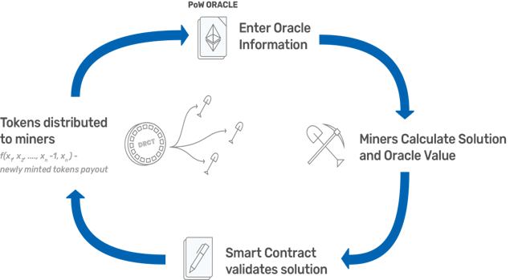

<p align="center">
  <a href='https://www.tellor.io/'>
    
  </a>
</p>

<p align="center">

  <a href='https://deriveth.slack.com/'>
    
  </a>
  <a href='https://t.me/daxiachat'>
    
  </a>
  <a href='https://twitter.com/DaxiaOfficial'>
    
  </a> 
</p>

## Table of Contents

* [Instructions for quick start with Truffle Deployment](#Quick-Deployment)
   * [Detailed documentation for self setup](./SetupDocumentation.md)
* [Overview](#overview)
    * [In-Depth Overview](./InDepthOverview.md)

<details><summary>Contributing information</summary>

   * [Maintainers](#Maintainers)
   * [How to Contribute](#how2contribute)
   * [Copyright](#copyright)
 </details>

# Tellor Oracle


### Instructions for quick start with Truffle Deployment <a name="Quick-Deployment"> </a> 
Follow the steps below to launch the Oracle contracts using Truffle. 

1. Open two terminals.

2. On one terminal run:
    Clone the repo, cd into it, and then run:

    $ npm install

    $ truffle compile

    $ truffle migrate

    $ truffle exec scripts/01_DeployTellor.js

#### Testing through Truffle<a name="testing"> </a>


3. On the second termila run:
```solidity
   $ ganache-cli -m "nick lucian brenda kevin sam fiscal patch fly damp ocean produce wish"
```
4. On the first terminal run: 
```solidity
    $   truffle test
```
5. And wait for the message 'START MINING RIG!!'
6. Kick off the python miner file [./miner/testMinerB.py](./miner/testMinerB.py).


Production and test python miners are available under the miner subdirectory [here](./miner/). You will need to get at least 5 miners running.

Step by step instructions on setting up a Mineable Oracle without truffle are available here: [Detailed documentation for self setup](./SetupDocumentation.md)


## Overview <a name="overview"> </a>  
Ethereum smart contracts cannot access off-chain data. If your smart contract relies on off-chain (e.g. internet) data to evaluate or execute a function, you either have to manually feed the data to your contract, incentivize users to do it, or rely on a centralized party to provide the data (Oraclize.it is generally the standard). 

<b>The tellor oracle</b> is a decentralized oracle. It provides a decentralized alternative for contracts to interact with and obtain data from off-chain (aka API data). 

Tellor implements a hybrid Proof-of-work (PoW)/Proof-of-Stake (PoS) model where miners have to stake tellor tributes (tellor's native token) to be able to mine and along with the PoW solution they also provide an off-chain data point. The first five miners to provide the PoW and off-chain data point are rewarded: the miner with the median value is given the highest reward since that is what is used as the 'official' value and the four miners get a lower reward that decreases the further they are from the median. Once validated and processed the value is available for on-chain contracts to use. The value can be disputed by anyone holding tellor tributes within 10 blocks after being mined for a fee. After the value goes to dispute, anyone holding tributes can vote on it's validity. If the vote determines the value was invalid the reporting party gets awarded the miner's stake, otherwise the wrongly accused miner gets the reporting fee. 

<p align="center">

</p>

A deep dive in methodology is available here: [In-Depth Overview](./InDepthOverview.md)

  

### Useful links <a name="useful-links"> </a>
High level inspiration from [EIP918 Mineable Token](https://github.com/ethereum/EIPs/blob/master/EIPS/eip-918.md).

Why we need a decentralized option? Checkout: ["Trusted third parties are security holes" ~ Nick Szabo, 2001](https://nakamotoinstitute.org/trusted-third-parties/)

Metamask - www.metamask.io 

Truffle - http://truffleframework.com/

If you have questions, ask us on Slack: https://deriveth.slack.com/

#### Maintainers <a name="maintainers"> </a> 
[@themandalore](https://github.com/themandalore)
<br>
[@brendaloya](https://github.com/brendaloya) 


#### How to Contribute<a name="how2contribute"> </a>  
Join our slack, shoot us an email or contact us: [](https://deriveth.slack.com/)
[](https://t.me/ddaorg)
[](https://discordapp.com/invite/xtsdpbS)

Check out or issues log here on Github or contribute to our future plans to implement a GPU miner(not built in python), provide a way to pay in Ether for data, and improve our reward/incentives mechanism. 

Any contributions are welcome!

### Updates <a name="updates"> </a>
We are happy to report that a successful Tellor build has successfully compiled and been deployed to the Rinkeby testnet. 

July 8, 2018--A proof-of-work oracle project that was the first iteration of this idea was a submission to <b>Angel Hack's Washington DC Hackathon</b> hosted on July 7th - 8th.  It was designed, spec'ed, built, and deployed in a 24-hour agile sprint. For a quick overview of the oracle origins checkout our article, [Proof-of-Work Oracle](https://medium.com/@nfett/proof-of-work-oracle-6de6f795d27).

September 30, 2018--This project has been revised to improve efficiency.

December 10, 2018 -- This project has been revised to improve security. 

<i>We invite you</i> to audit and test our project - and submit any issues to the repo directly.

#### Contributors<a name="contributors"> </a>

This repository is maintained by the Tellor team - [www.tellor.io](https://www.tellor.io)


#### Copyright

Tellor Inc. 2019
