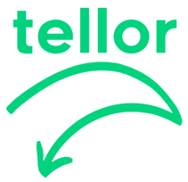
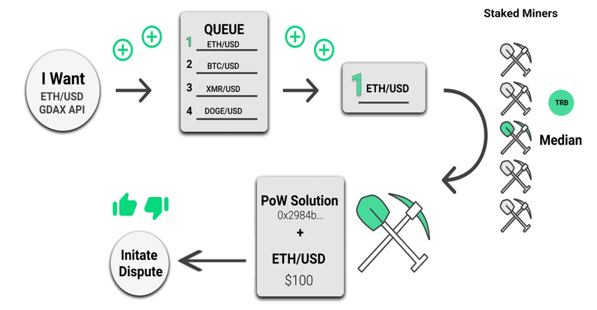

<p align="center">
  <a href='https://www.tellor.io/'>
    
  </a>
</p>

<p align="center">
  <a href='https://twitter.com/WeAreTellor'>
    
  </a> 
</p>

* 

## Table of Contents

* [Instructions for quick start with Truffle Deployment](#Quick-Deployment)
   * [Detailed documentation for self setup](https://tellor.readthedocs.io/en/latest/DevDocumentation/)
* [Overview](#overview)
    * [In-Depth Overview](https://tellor.readthedocs.io/en/latest/)

<details><summary>Contributing information</summary>

   * [Maintainers](#Maintainers)
   * [How to Contribute](#how2contribute)
   * [Copyright](#copyright)
 </details>

# Tellor Oracle


### Instructions for quick start with Truffle Deployment <a name="Quick-Deployment"> </a> 
Follow the steps below to launch the Oracle contracts using Truffle. 

1. Open two terminals.

2. On one terminal run:
    Clone the repo, cd into it, and then run:
```
    $ npm install
    $ truffle compile
    $ truffle migrate
    $ truffle exec scripts/01_DeployTellor.js
```
#### Testing through Truffle<a name="testing"> </a>


3. On the second termial run:
```solidity
  $ ganache-cli -m "nick lucian brenda kevin sam fiscal patch fly damp ocean produce wish"
```
4. On the first terminal run: 
```solidity
  $ truffle test
```
5. And wait for the message 'START MINING RIG!!'
6. Kick off the python miner file [./miner/testMinerB.py](./miner/testMinerB.py).


Production and test python miners are available under the miner subdirectory [here](./miner/). You will need to get at least 5 miners running.

Step by step instructions on setting up a Tellor Oracle without truffle are available here: [Detailed documentation for self setup](https://tellor.readthedocs.io/en/latest/DevDocumentation/)


## Overview <a name="overview"> </a>  
Ethereum smart contracts cannot access off-chain data. If your smart contract relies on off-chain (e.g. internet) data to evaluate or execute a function, you either have to manually feed the data to your contract, incentivize users to do it, or rely on a centralized party to provide the data.

<b>The Tellor oracle</b> is a decentralized oracle. It provides an option for contracts to securely interact with and obtain data from off-chain.

Tellor implements a staked PoW where miners have to deposit Tellor Tributes (tellor's native token) to be able to mine and along with the PoW solution they also provide an off-chain data point. The first five miners to provide the PoW and off-chain data point are rewarded and the median is selected as the official value. Once validated and processed the value is available for on-chain contracts to use. The value can be disputed by anyone holding tellor tributes within one day after being mined for a fee. After the value goes to dispute, anyone holding tributes can vote on it's validity. If the vote determines the value was invalid the reporting party gets awarded the miner's stake, otherwise the wrongly accused miner gets the dispute fee. 

<p align="center">

</p>

A deep dive in methodology is available here: [In-Depth Overview](https://tellor.readthedocs.io/en/latest/)

  
### Using in your project (NPM)

    npm install usingtellor


### Useful links <a name="useful-links"> </a>
High level inspiration from [EIP918 Mineable Token](https://github.com/ethereum/EIPs/blob/master/EIPS/eip-918.md).

Why we need a decentralized option? Checkout: ["Trusted third parties are security holes" ~ Nick Szabo, 2001](https://nakamotoinstitute.org/trusted-third-parties/)

Metamask - www.metamask.io 

Truffle - http://truffleframework.com/


#### Maintainers <a name="maintainers"> </a> 
[@themandalore](https://github.com/themandalore)
<br>
[@brendaloya](https://github.com/brendaloya) 


#### How to Contribute<a name="how2contribute"> </a>  
Join our Discord or Telegram:
[](https://t.me/tellor)
[](https://discord.gg/zFcM3G)

Check out or issues log here on Github or contribute to our future plans to build a better miner and more examples of data secured by Tellor. 


#### Contributors<a name="contributors"> </a>

This repository is maintained by the Tellor team - [www.tellor.io](https://www.tellor.io)


#### Copyright

Tellor Inc. 2019
